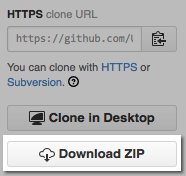

{: section gs-sidebar :}

#### What if I already have a test environment? { .sidebar }

Let's use it! These instructions are intended to get you into a working
environment where you can learn SaltStack without a lot of set up, but your own
environment can be used instead.

{: end gs-sidebar :}

This Getting Started Guide walks you through the fundamental concepts you need
to learn as you start using SaltStack. We'll explain how to:

- Install SaltStack
- Run commands on managed systems
- Define re-usable configurations
- Apply commands and configurations to specific systems

Learning SaltStack is a hands-on experience. While you can get the hang of
things by reading this guide, SaltStack is easy to set up and we've included
several examples you can run to help you learn. Plus, you can keep your demo
environment around after you finish to continue to try things out.

## Demo Environment

{: section gs-sidebar :}

#### Vagrant Basics { .sidebar }

After you run vagrant up, Vagrant creates and starts several VirtualBox VMs in
the background. These virtual machines keep running until you shut them down,
so make sure you run vagrant halt when you are finished:

```bash
vagrant halt
```

To start them up again, run `vagrant up`.

If you want to start over, you can run `vagrant destroy`, and then `vagrant up`.

{: end gs-sidebar :}

Complete these instructions to set up a simple SaltStack environment.

1.  Install [VirtualBox](https://www.virtualbox.org/).

2.  Install [Vagrant](https://www.vagrantup.com/).

3.  Download <https://github.com/UtahDave/salt-vagrant-demo>. You can use git
    or download a zip of the project directly from GitHub:

    

4.  Extract the zip file you downloaded, and then open a command prompt to the extracted directory:

    

    ```bash
    cd %homepath%\Downloads\salt-vagrant-demo-master
    ```
    

    ```bash
    cd ~\Downloads\salt-vagrant-demo-master
    ```

5.  Run vagrant up to start the demo environment:

    ```bash
    vagrant up
    ```
After Vagrant ups (~10 minutes) and you are back at the command prompt, you are
ready to continue with this guide.

