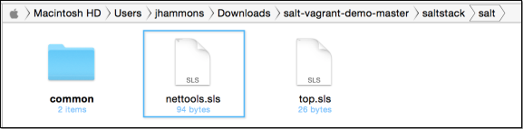
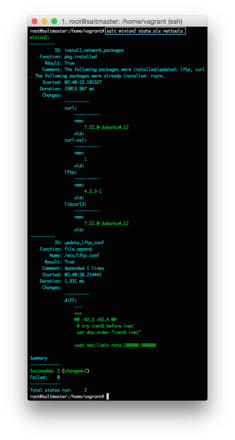
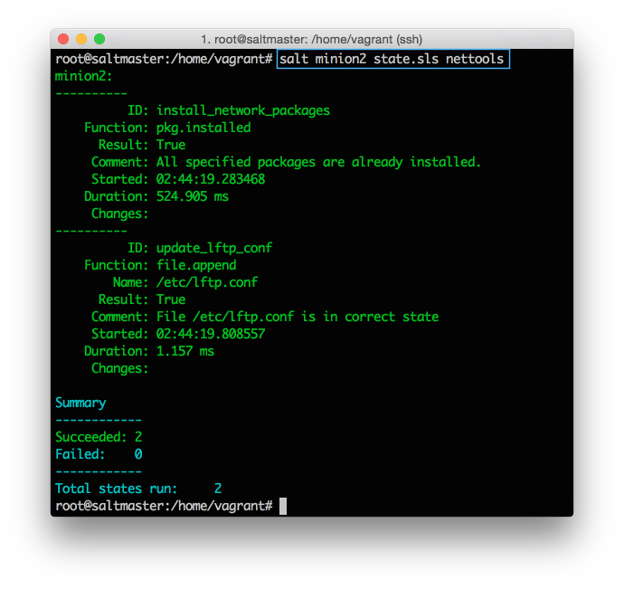

{: section gs-sidebar :}

#### Terminology  { .sidebar } 

-|-
| Formula | A collection of state and pillar files that configure an application or system component. Most Formulas are made up of several states spread across multiple state files.|
| State | A reusable declaration that configures a specific part of a system. Each state is defined using a state declaration.|
| State Declaration | A top level section of a state file that lists the state function calls and arguments that make up a state. Each state declaration starts with a unique ID.|
| State Functions | Commands that you call to perform a configuration task on a system.|
| State File | A file with an SLS extension that contains one or more state declarations.|
| Pillar File | A file with an SLS extension that defines custom variables and data for a system.|

#### YAML Ain't Markup Language

Salt uses a simple language, called YAML, to describe configurations. This is what you need to know:

-   YAML uses a fixed indentation scheme to represent relationships between
    data layers. Salt requires that the indentation for each level consists of
    exactly two spaces. Do not use tabs.
-   A dash represents an item in a list.
-   Key value pairs are represented by *key*:*value*

#### Execution Order

Commands in state files are executed from top to bottom. In this example, the
packages are installed before the configuration file is updated because that
section appears first in the file. SaltStack also provides a powerful requisite
system that lets you explicitly determine order, which we'll cover in a later
tutorial.

{: end gs-sidebar :}

Remote execution is a big time saver, but it has some shortcomings. Most tasks
you perform are a combination of many commands, tests, and operations, each
with their own nuances and points-of-failure. Often an attempt is made to
combine all of these steps into a central shell script, but these quickly get
unwieldy and introduce their own headaches.

To solve this, SaltStack configuration management lets you create a re-usable
configuration template, called a state, that describes everything required to
put a system component or application into a known configuration.

States are much easier to understand when you see them in action, so let's make
one. States are described using YAML, and are simple to create and read.

To simplify things, our Vagrant file maps the `/srv/salt` directory on your Salt
master to the local `salt-vagrant-demo-master/saltstack/salt` directory. This
means that you can use a local text editor and save the file to the local file
system, and Vagrant makes it appear as if it were on the Salt master.

Using any plain text editor, create a new text file and add the following:

``` yaml
install_network_packages:
  pkg.installed:
    - pkgs:
      - rsync
      - lftp
      - curl
```

This state calls the `pkg.installed` state function, and passes a list of three
package names for the `pkgs` argument.

Save this example as `salt-vagrant-demo-master/saltstack/salt/nettools.sls`:



Lets go ahead and test our state. We'll learn about a more powerful method to
apply states, called highstate, in the next section, but for now you can use
the state.apply command to apply a state directly from the command line.

On your Salt master, run the following command to apply the nettools state:

``` bash
salt 'minion2' state.apply nettools
#state.apply was added in 2015.5, so if you are using an earlier version call state.sls instead.
```

As you might have guessed, you can use the targeting mechanism to apply this
state to any set of Salt minions. For now just pick one or all of your Salt
minions. If everything goes well, you'll get output similar to this (click to
enlarge):



If that is not cool enough, apply the state again to the same Salt minion(s),
and look at the output:



Salt determines that the system is already in the correct state, so nothing is
changed (this is called idempotent in academic circles). Nice.

## Restarting Services, Variables, and more

States can restart services when changes are made, copy entire directories,
explicitly require that other states run first, use variables, and much more.

You'll learn more about the state system when you go through the Configuration
Management Get Started Guide. For now this basic understanding of states is
enough to get started. Remember the powerful method we mentioned earlier to
apply states? Let's tackle that.

