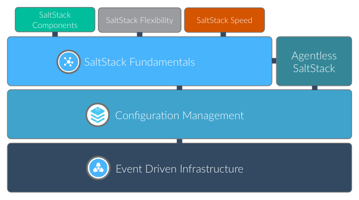

{: section gs-sidebar :}

#### What is SaltStack? {.sidebar}

SaltStack is a revolutionary approach to infrastructure management that
replaces complexity with speed. SaltStack is simple enough to get
running in minutes, scalable enough to manage tens of thousands of
servers, and fast enough to communicate with each system in seconds.

{: end gs-sidebar :}

This Get Started Guide walks you through the basics of getting SaltStack
up and running. You'll learn how to:

-   Install and configure SaltStack
-   Remotely execute commands across all managed systems
-   Design, develop, and deploy system configurations
-   Use the Salt Reactor to automate your infrastructure
-   Coordinate complex management operations using SaltStack
    Orchestration

**Click a topic to Get Started**:

<map name="getstarted">
  <area shape="rect" coords="68,14,251,67" href="overview.html" alt="Learn about the components in SaltStack">
  <area shape="rect" coords="273,14,453,67" href="flexibility.html" alt="Learn about the different management approaches in SaltStack">
  <area shape="rect" coords="479,14,661,66" href="speed.html" alt="Learn what makes SaltStack fast">
  <area shape="rect" coords="11,70,718,179" href="fundamentals/index.html" alt="Learn how to use the foundational components in SaltStack">
  <area shape="rect" coords="11,180,718,287" href="config/index.html" alt="Learn about SaltStack's configuration management system">
  <area shape="rect" coords="11,289,718,398" href="event/index.html" alt="Create an event driven infrastructure using SaltStack">
</map>

