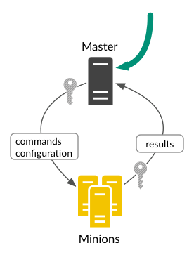
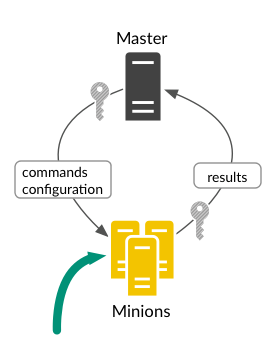
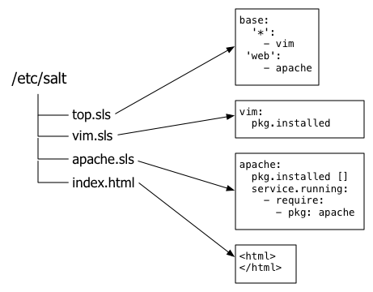
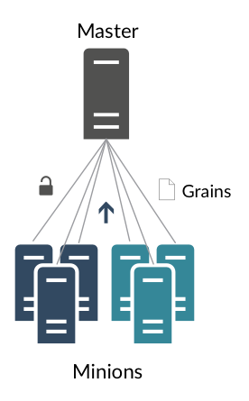
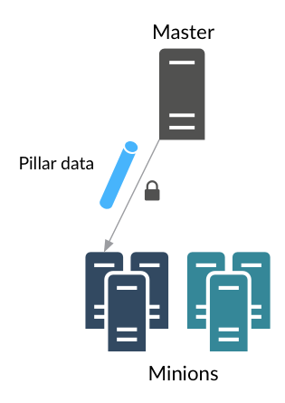
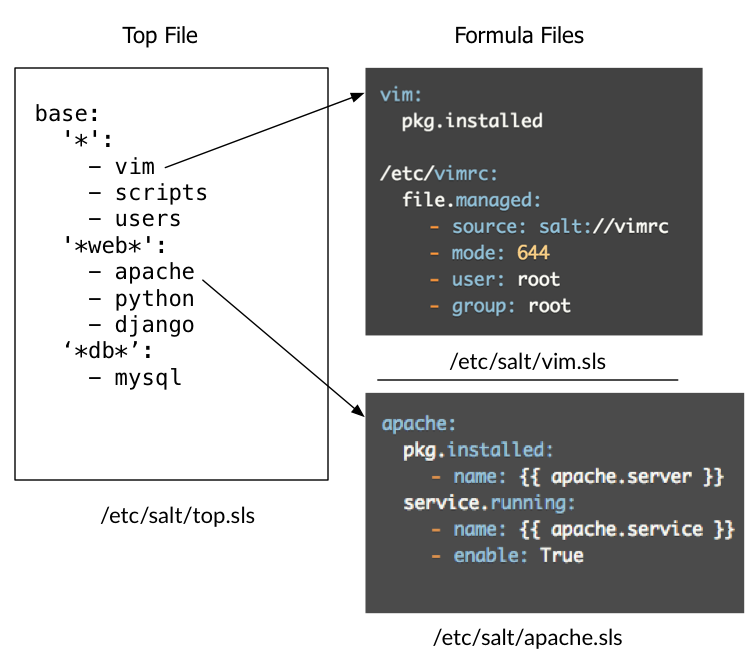
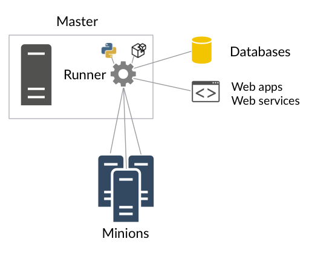
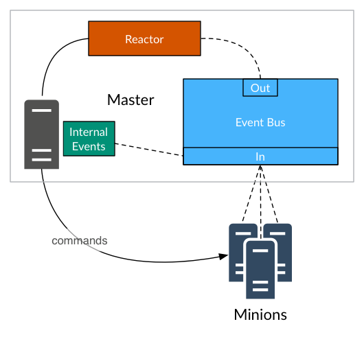
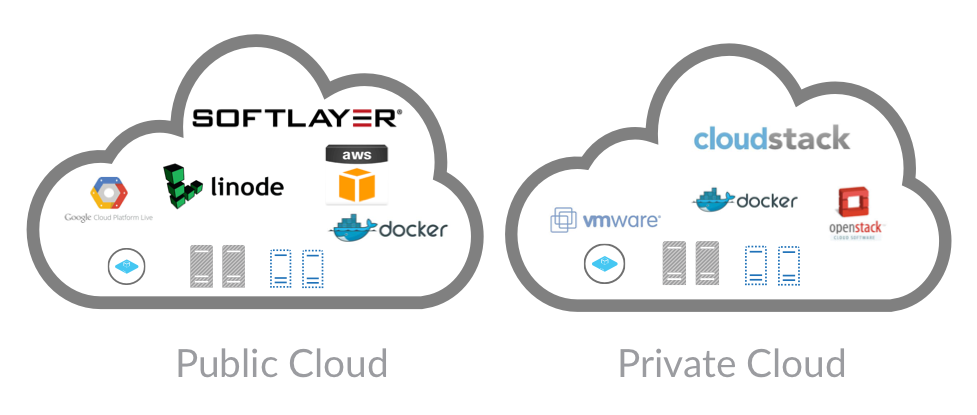
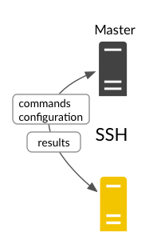

# SaltStack Components

You'll get a better test introduction to these components in the tutorial,
but it is helpful to a general idea of the role each component plays in
SaltStack.

+--------------------------+--------------------------+--------------------------+
| Salt Master              |    | Central management       |
|                          |                          | system.                  |
|                          |                          |                          |
|                          |                          | This system is used to   |
|                          |                          | send commands and        |
|                          |                          | configurations to the    |
|                          |                          | Salt minion that is      |
|                          |                          | running on managed       |
|                          |                          | systems.                 |
+--------------------------+--------------------------+--------------------------+
| Salt Minions             |   | Managed system.          |
|                          |                          | This system runs the     | 
|                          |                          | Salt minion which        |
|                          |                          | receives                 |
|                          |                          | commands and             |
|                          |                          | configuration from the   |
|                          |                          | Salt master.             |
+--------------------------+--------------------------+--------------------------+
| Execution Modules        |                         | from the command line    |
|                          |                          | against one or more      |
|                          |                          | managed systems. Useful  |
|                          |                          | for:                     |
|                          |                          |                          |
|                          |                          | -   Real-time            |
|                          |                          |     monitoring, status,  |
|                          |                          |     and inventory        |
|                          |                          | -   One-off commands and |
|                          |                          |     scripts              |
|                          |                          | -   Deploying critical   |
|                          |                          |     updates              |
+--------------------------+--------------------------+--------------------------+
| Formulas (States)        |    | A declarative or         |
|                          |                          | imperative               |
|                          |                          | representation of a      |
|                          |                          | system configuration.    |
+--------------------------+--------------------------+--------------------------+
| Grains                   |    | System variables. Grains |
|                          |                          | are static information   |
|                          |                          | about the underlying     |
|                          |                          | managed system and       |
|                          |                          | include operating        |
|                          |                          | system, memory, and many |
|                          |                          | other system properties. |
|                          |                          | You can also define      |
|                          |                          | custom grains for any    |
|                          |                          | system.                  |
+--------------------------+--------------------------+--------------------------+
| Pillar                   |    | User-defined variables.  |
|                          |                          | These secure variables   |
|                          |                          | are defined and stored   |
|                          |                          | on the Salt Master and   |
|                          |                          | then 'assigned' to one   |
|                          |                          | or more minions using    |
|                          |                          | targets. Salt pillar data     |
|                          |                          | stores values such as    |
|                          |                          | ports, file paths,       |
|                          |                          | configuration            |
|                          |                          | parameters, and          |
|                          |                          | passwords.               |
+--------------------------+--------------------------+--------------------------+
| Top File                 |  | Matches formulas and     |
|                          |                          | Salt pillar data to Salt      |
|                          |                          | minions.                 |
+--------------------------+--------------------------+--------------------------+
| Runners                  |   | Modules that execute on  |
|                          |                          | the Salt master to       |
|                          |                          | perform supporting       |
|                          |                          | tasks. Salt runners report    |
|                          |                          | job status, connection   |
|                          |                          | status, read data from   |
|                          |                          | external APIs, query     |
|                          |                          | connected Salt minions,  |
|                          |                          | and more.                |
|                          |                          |                          |
|                          |                          | For example, the         |
|                          |                          | Orchestrate runner       |
|                          |                          | coordinates              |
|                          |                          | configuration            |
|                          |                          | deployments across many  |
|                          |                          | systems.                 |
+--------------------------+--------------------------+--------------------------+
| Returners                |                         | Salt minions to another  |
|                          |                          | system, such as a        |
|                          |                          | database. Salt returners can  |
|                          |                          | run on the Salt minion   |
|                          |                          | or on the Salt master.   |
+--------------------------+--------------------------+--------------------------+
| Reactor                  |   | Trigger reactions when   |
|                          |                          | events occur in your     |
|                          |                          | SaltStack environment.   |
+--------------------------+--------------------------+--------------------------+
| Salt Cloud / Salt Virt   |     | Provision systems on     |
|                          |                          | cloud providers /        |
|                          |                          | hypervisors and          |
|                          |                          | immediately bring them   |
|                          |                          | under management.        |
+--------------------------+--------------------------+--------------------------+
| Salt SSH                 |       | Run Salt commands over   |
|                          |                          | SSH on systems that do   |
|                          |                          | not have a Salt minion.  |
+--------------------------+--------------------------+--------------------------+
